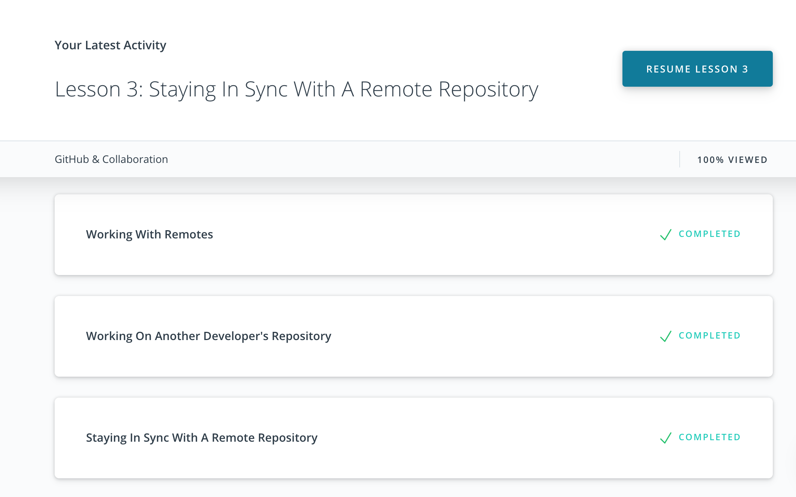
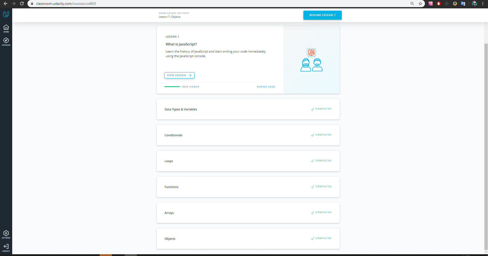
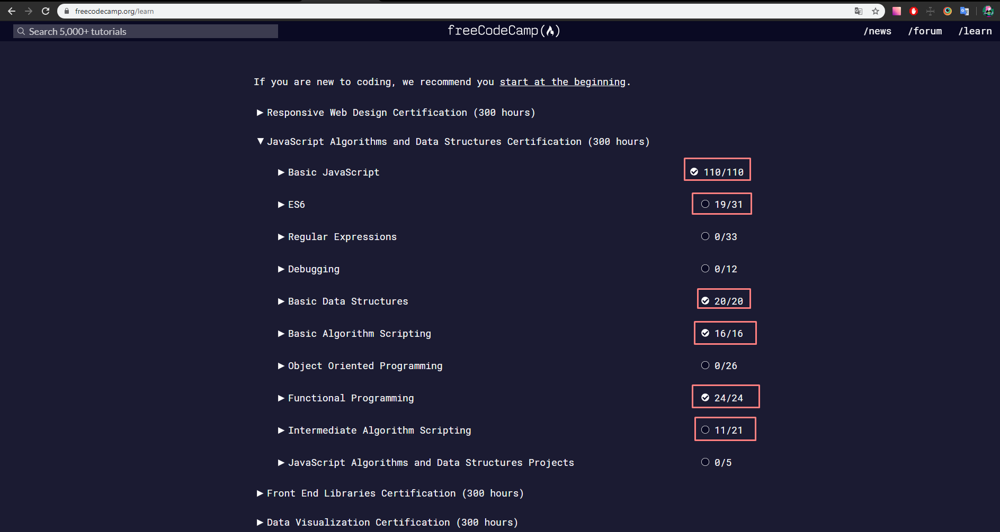
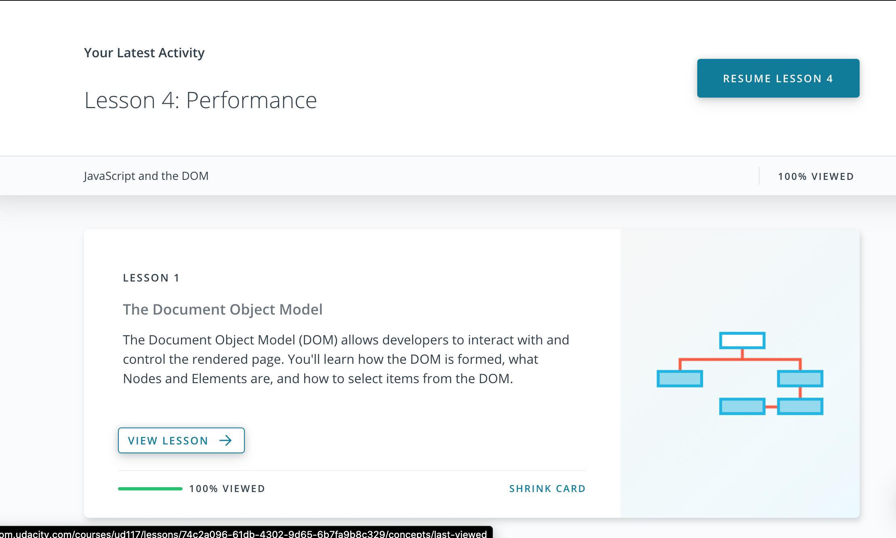
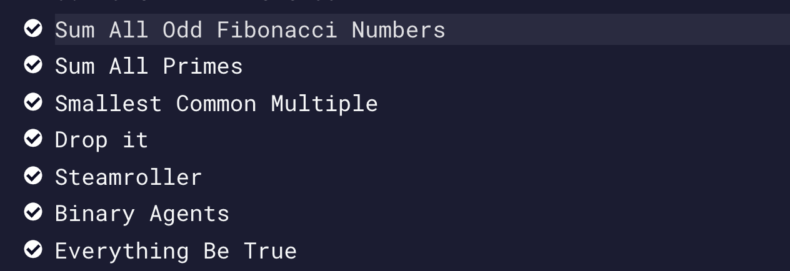
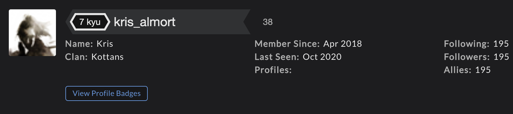

# Kottans Front-End course

Repository for Front-End Course Kottans

## Git intro

Я использовала раньше git для своих проектов, но не разбиралась во многих инструментах, которые он предоставляет, только в основных.
Курс помог мне закрыть пробелы в знаниях и теперь я более уверенно себя чувствую, используя git.

**Сompleted course "How to use Git and GitHub"**

Некоторые моменты записывала, чтобы лучше запомнить :)

## Linux CLI, and HTTP

У меня был практический опыт консоли, использовала базовые команды, например навигацию и редактирование файлов.
В курсе было много новых вещей, в частности grep, перенаправление ввода и вывода, который показался мне очень удобным и теперь стараюсь использовать его на практике,
настройка среды. Было сложно с bash скриптами, но победила :) По http, кроме статьи, смотрела дополнительно материалы на youtube, разобралась.

## VCS (hello gitty), GitHub and Collaboration

Вернулась к этой теме позже, далась легко и быстро, так как работаю с этим каждый день.

## Intro to HTML and CSS

Тема для меня была не новой, поэтому далась легко.

## Responsive Web Design

Тема не новая, но хорошо структурировала информацию по адаптивности и флексам.
Flexbox froggy проходила уже несколько раз, когда-то прохождение вызывало трудности, но в этот раз все было очень легко и быстро.

## HTML & CSS Practice

Поработала с доступностью, на реальных проектах частенько об этом забывают. Практика выполнена и заапрувлена.

[demo](https://chris-voitova.github.io/kottans-popup-practice/)
[code](https://github.com/chris-voitova/kottans-popup-practice)

## JS Basics

Закончила все темы, на freecodecamp для уровня на тот момент было местами сложно. Заметила, как вырос скилл после этой главы. По впечатлениям это самая основная тема курса, которая потом помогает разбираться с js дальше.

## Document Object Model

Раньше делала похожее задание на работе, поэтому сложностей не было. Плюс делала это задание уже перед friends app, когда уже немного разобралась с js. Практика выполнена и заапрувлена.

[demo](https://chris-voitova.github.io/kottans-dom/)
[code](https://github.com/chris-voitova/kottans-dom)

## Building a Tiny JS World (pre-OOP)

Раньше ничего не знала про OOP, это была первая проба. Помогло подробно понять что под капотом, разобрать тему.
Практика выполнена и заапрувлена.

[demo](https://chris-voitova.github.io/a-tiny-JS-world/)
[code](https://github.com/chris-voitova/a-tiny-JS-world)

## Object Oriented JS

[codewars profile](https://www.codewars.com/users/kris_almort)

С frogger было сложно из-за того, что это полуготовый проект и нужно было его изначально хотя бы собрать. Помогло видео других студентов прошлого набора, инструкция как сделать первоначальную сборку. Дальше итерация ревью и проект готов) Практика выполнена и заапрувлена.

[demo](https://chris-voitova.github.io/frontend-nanodegree-arcade-game/)
[code](https://github.com/chris-voitova/frontend-nanodegree-arcade-game)

## OOP Exercise

Переписала a-tiny-JS-world на классы.
Практика выполнена и заапрувлена.

[demo](https://chris-voitova.github.io/a-tiny-JS-world/)
[code](https://github.com/chris-voitova/a-tiny-JS-world)

## Memory – Pair Game

По сложности было нормально, подкачала уровень js. Заметила на этой задаче, что выросла чистота кода, благодаря постоянным ревью моей практики и фидбеку менторов.

[demo](https://chris-voitova.github.io/memory-pair-game/)
[code](https://github.com/chris-voitova/memory-pair-game)
