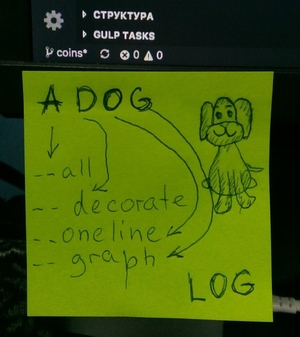
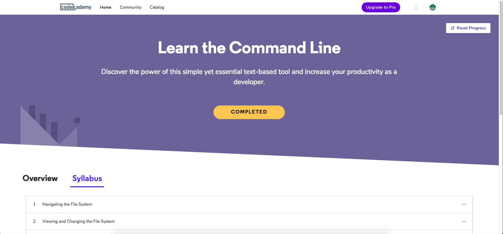
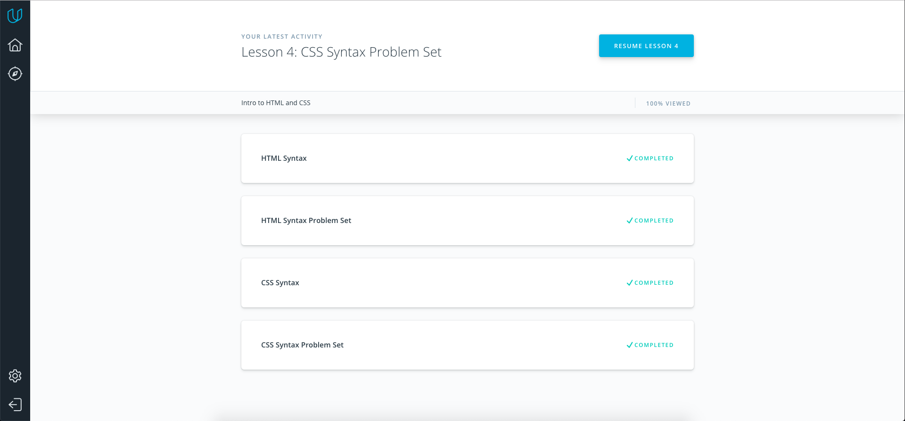
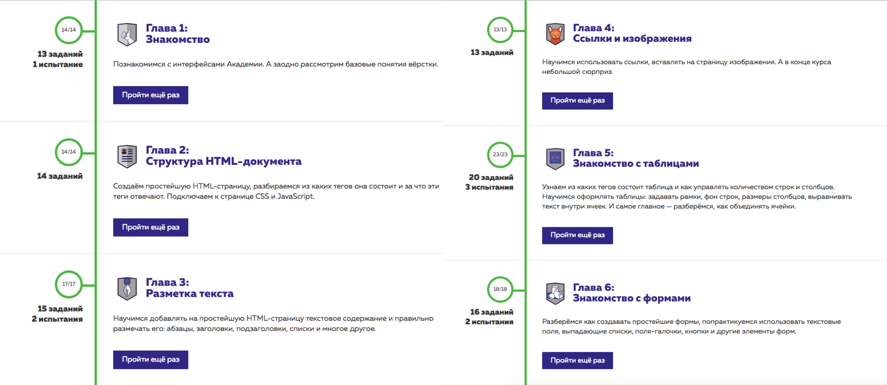
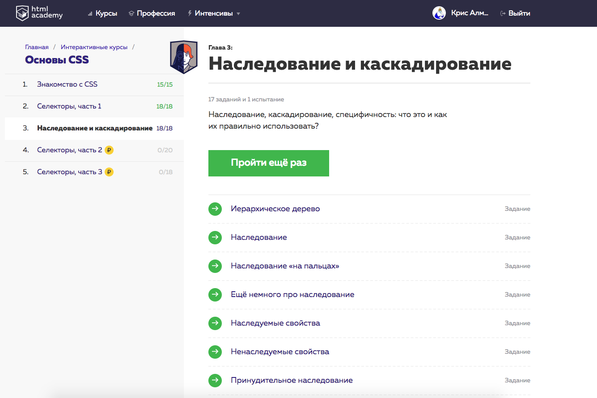
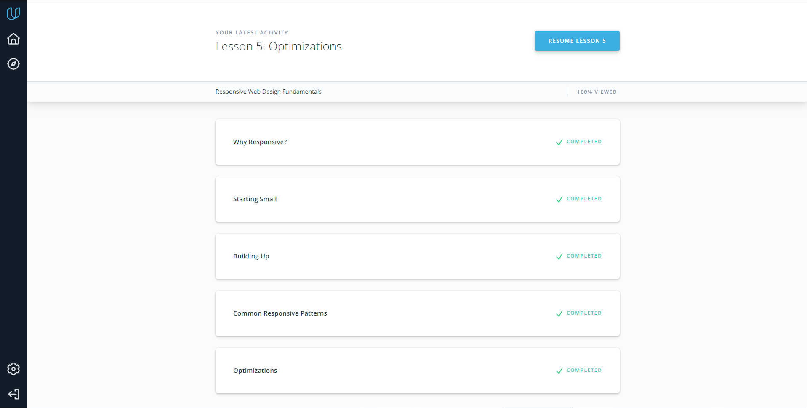
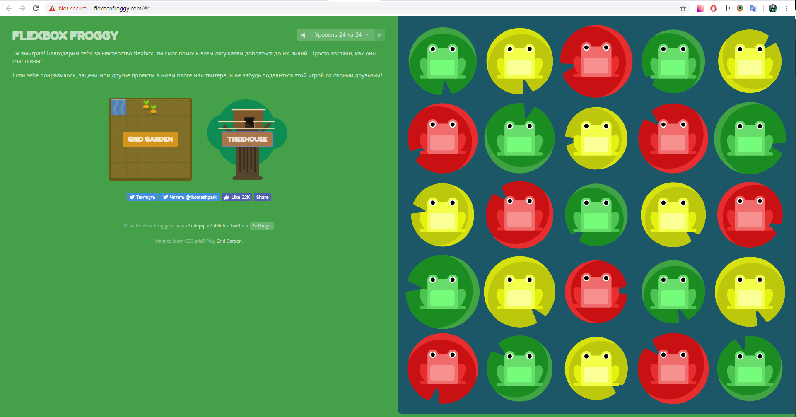

# Kottans Front-End course
Repository for Front-End Course Kottans
## Git intro
Я использовала раньше git для своих проектов, но не разбиралась во многих инструментах, которые он предоставляет, только в основных.
Курс помог мне закрыть пробелы в знаниях и теперь я более уверенно себя чувствую, используя git.

**Сompleted course "How to use Git and GitHub"**

Некоторые моменты записывала, чтобы лучше запомнить :)

## Linux CLI, and HTTP

У меня был практический опыт консоли, использовала базовые команды, например навигацию и редактирование файлов.
В курсе было много новых вещей, в частности grep, перенаправление ввода и вывода, который показался мне очень удобным и теперь стараюсь использовать его на практике,
настройка среды. Было сложно с bash скриптами, но победила :) По http, кроме статьи, смотрела дополнительно материалы на youtube, разобралась.

## Intro to HTML and CSS

Тема для меня была не новой, поэтому далась легко. Повторила то, что знала.

## Responsive Web Design

Тема не новая, но хорошо структурировала информацию по адаптивности и флексам.
Flexbox froggy проходила уже несколько раз, когда-то прохождение вызывало трудности, но в этот раз все было очень легко и быстро.

##HTML & CSS Practice
Сверстала поп-ап, студенты p2p сделали ревью, менторы смерджили пулл реквест
[репозиторий](https://github.com/kris-almort/kottans-popup-practice)
